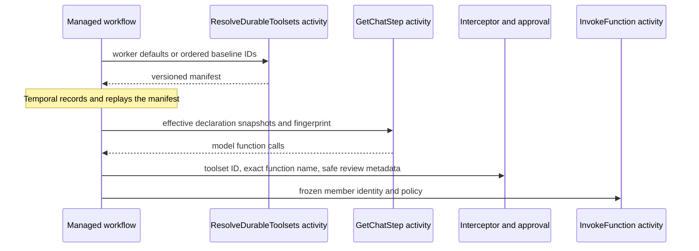

# Durable toolsets

Durable toolsets are stable, worker-owned groups of MEAI function declarations, implementations,
and durable dispatch policies. They let the stock managed workflow accept a thin client request
without requiring the client process to construct tool schemas or reference implementation types.

## Authority boundary

Worker registration is live process state and cannot be read by deterministic workflow code. A
package-owned activity therefore resolves the selected worker toolsets once for a new session and
returns a serializable manifest. Temporal records that result in workflow history. The workflow
uses the recorded manifest as the maximum session authority, carries it unchanged through
Continue-as-New, and never refreshes it from the worker registry.

A custom typed workflow may narrow its recorded baseline for one turn. It cannot add a toolset or
function absent from that baseline. The stock thin client does not select toolsets per request in
this feature. Exposure to the model is not business authorization: effecting tools must reauthorize
against current authoritative application data inside their activity.

## Registration rules

- `AddDurableTools` contributes functions to one implicit default toolset.
- `AddDurableToolset(id, ...)` registers a non-empty named toolset.
- `DefaultToolsetIds` composes ordered named toolsets for the stock workflow. `null` selects the
  implicit default; an empty list deliberately exposes no tools.
- `AddDurableToolFactory` registers invocation-scoped activation behind a stable declaration.
- Toolset IDs and visible function names use `StringComparer.Ordinal` everywhere.
- Selected toolsets are combined in configured order; members retain registration order.
- Duplicate selected IDs or visible names fail. There is no precedence or silent deduplication.
- Registrations contain implementations; durable manifests never contain implementations,
  delegates, service providers, reflection objects, or CLR types.
- Explicit defaults and the implicit `AddDurableTools` toolset cannot be mixed. Register every
  selected default as a named toolset when more than one group is required.

## Manifest compatibility

The first manifest wire format is version `1`. Missing version `0` and unsupported versions fail
non-retryably before model or tool dispatch. The reader may ignore an additive unknown JSON field,
but an authority-bearing change requires a new manifest version or an operational drain of older
sessions. Canonical fingerprint encoding, field order, and exact ordinal name semantics are part of
the versioned contract.

Changing default selection or durable policy does not rewrite a running session's recorded
manifest. To adopt a changed baseline, start a new session; runtime refresh is intentionally
unsupported. Workers serving in-flight sessions must retain compatible activation keys and
function schemas for every recorded member. An incompatible binding fails before application code
runs rather than silently dispatching a different implementation.

## Authority behavior

| Input/session shape | Effective authority | Result |
|---|---|---|
| No declarations or manifest; worker defaults exist | Resolved worker manifest | Resolve once, then run |
| No declarations or manifest; no defaults | Empty worker manifest | Normal no-tools model call |
| Caller declarations only | Caller-owned snapshot | Advanced mode; no resolver |
| Caller declarations and worker manifest | Ambiguous | Non-retryable failure before model or resolver activity |
| Custom turn omits `ToolsetIds` | Complete recorded baseline | Run with baseline |
| Custom turn supplies an empty list | No tools for that turn | Run model with no tools |
| Custom turn supplies a baseline subset | Baseline-ordered subset | Run with frozen subset |
| Custom turn names an ID outside the baseline | Attempted expansion | Non-retryable failure before model activity |
| Model returns an unselected or unknown function | Not enabled | Same safe blocked result; no tool activity |
| Continue-as-New | Recorded session baseline | Carry unchanged; never resolve again |

The manifest fingerprint covers the ordered declarations and durable policy. Each member also has
a stable identity fingerprint over its toolset ID, activation key, and declaration. The workflow
binds that identity to the full manifest fingerprint in every internal tool-activity input. The
activity validates this binding and the worker's exact activation before it creates a factory or
invokes a function. A malformed name, schema fingerprint, toolset ID, activation key, manifest
fingerprint, or binding fails non-retryably without reaching application code.

These checks protect package boundaries and deterministic dispatch; they are not an authorization
system. Tool exposure controls what the model may request. A write tool must still authorize the
current subject and resource immediately before its external effect. Public blocked results do not
distinguish an unknown function from a baseline-known but unselected function, and never list the
worker registry.

## Resolution sequence

The manifest contains declaration snapshots, resolved activity policies, origin toolset IDs, and
opaque worker activation keys. It contains no function instances, factories, delegates, service
providers, `Type`, or `MethodInfo`. The resolver validates requested IDs, selection duplicates,
visible-name collisions, declaration support, and policy values before returning the manifest.

The v1 fingerprint is `tai-toolset-v1:` plus the lowercase SHA-256 hash of the canonical JSON
representation of manifest version, ordered toolset IDs, and ordered members. Object properties are
sorted ordinally; array order is preserved. The empty v1 manifest vector is
`tai-toolset-v1:60051ad63143350993d6849484391752110cd71d72234847dd6275a93bc5623d`.
